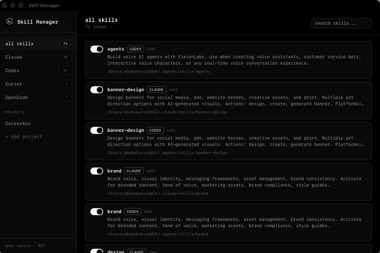

<div align="center">


# Skill Manager

### One dashboard to manage every AI coding agent skill you've installed.

Discover, enable, disable, edit, and delete [Agent Skills](#what-is-a-skill)
across Claude Code, Codex, Cursor, and OpenCode — without hand-editing a
config file ever again.

[](LICENSE)
[](https://tauri.app)
[](https://www.typescriptlang.org/)
[](https://github.com/abubakarsiddik31/skill-manager/releases/latest)
[](#download)
[](CONTRIBUTING.md)

[**Website**](https://abubakarsiddik31.github.io/skill-manager/) ·
[**Download**](https://github.com/abubakarsiddik31/skill-manager/releases/latest) ·
[**Report a bug**](https://github.com/abubakarsiddik31/skill-manager/issues/new?template=bug_report.yml) ·
[**Contributing**](CONTRIBUTING.md)

<br />



</div>

---

## Contents

- [The problem](#the-problem)
- [What is a "skill"?](#what-is-a-skill)
- [Features](#features)
- [Supported tools](#supported-tools)
- [Download](#download)
- [Development](#development)
- [Project structure](#project-structure)
- [Roadmap](#roadmap)
- [Contributing](#contributing)
- [FAQ](#faq)
- [License](#license)

## The problem

If you use more than one AI coding agent, your skills are scattered across
`~/.claude/skills`, `~/.agents/skills`, `~/.cursor/skills`, and
`~/.config/opencode/skills` — four folders, four formats, zero shared view.

Left unchecked, this turns into **skill hell**: every skill you've ever
installed sits there active, and your agent has to disambiguate against all
of them just to pick the right one for what you're doing right now. A
crowded skills directory doesn't just look messy — the more skills compete
for a match, the worse an agent gets at triggering the right one. Disabling
what you don't need for the current project is how you climb back out.

| | Without Skill Manager | With Skill Manager |
| --- | --- | --- |
| **See what's installed** | Open a terminal, `ls` four different folders | One dashboard, every tool |
| **Turn a skill off** | Delete the folder and hope you don't need it back | Toggle it — fully reversible |
| **Keep triggering accurate** | Every installed skill competes for a match, even ones irrelevant to this project | Disable the noise, leave only what's relevant enabled |
| **Know what's wired into a project** | Global and project-level skills look identical until something breaks | Per-project breakdown, separate from global |
| **Edit a `SKILL.md`** | Open a text editor, hunt down the path | Rendered markdown with one-click raw edit |

**Skill Manager fixes all of it.** One dashboard, every tool.

## What is a "skill"?

Anthropic introduced **[Agent Skills](https://code.claude.com/docs/en/skills)**
— folders containing a `SKILL.md` file with instructions an AI coding agent
can load on demand — and the idea has since been picked up across the
ecosystem (Claude Code, Codex, Cursor, OpenCode, and others).

## Features

- 🗂️ **Unified view** across every tool's skills directory — no more digging
  through four different config folders by hand.
- 🔀 **Enable / disable** any skill without deleting it (skills move to a
  sibling `.disabled/` folder — fully reversible, and it never touches the
  tool's own config).
- 📝 **View & edit** — a skill's `SKILL.md` renders as formatted markdown by
  default, with a one-click switch to raw edit.
- 🗑️ **Delete** skills you no longer need.
- 📁 **Per-project breakdown** — track individual project folders and see
  exactly which skills are wired into each one, separate from your global
  skills.
- 🔍 **Search** across names and descriptions.

## Supported tools

| Tool | User-level directory | Project-level directory | Status |
| --- | --- | --- | --- |
| [Claude Code](https://claude.com/claude-code) | `~/.claude/skills` | `.claude/skills` | ✅ fully supported |
| [Codex](https://developers.openai.com/codex/skills) | `~/.agents/skills` | `.agents/skills` | ✅ fully supported |
| [Cursor](https://cursor.com/docs/skills) | `~/.cursor/skills` | `.cursor/skills` | ✅ fully supported |
| [OpenCode](https://opencode.ai/docs/skills/) | `~/.config/opencode/skills` | `.opencode/skills` | ✅ fully supported |

All four paths are verified against each tool's own docs — not guessed. If a
tool changes its convention, [open an issue](.github/ISSUE_TEMPLATE/tool_directory.yml)
and we'll update the adapter.

## Download

Grab a build from the [latest release](https://github.com/abubakarsiddik31/skill-manager/releases/latest):

| Platform | File |
| --- | --- |
| macOS (Apple Silicon + Intel) | `.dmg` (universal) |
| Windows | `.exe` or `.msi` |
| Linux | `.deb`, `.rpm`, or `.AppImage` |

Builds are unsigned — macOS Gatekeeper and Windows SmartScreen will warn on
first launch (right-click → Open on macOS, "More info" → "Run anyway" on
Windows). [Code-signed builds](#roadmap) are on the roadmap.

## Development

Requires [Node.js](https://nodejs.org/) and the
[Rust toolchain](https://www.rust-lang.org/tools/install) (Tauri's
prerequisites are documented [here](https://tauri.app/start/prerequisites/)).

```bash
git clone https://github.com/abubakarsiddik31/skill-manager.git
cd skill-manager
npm install
npm run tauri dev
```

To build a release binary for your platform:

```bash
npm run tauri build
```

## Project structure

```
src/
  components/           presentational react components (Sidebar, SkillCard, EditorModal, ...)
  hooks/                data + mutations (useGlobalSkills, useProjects, useProjectSkills)
  lib/                  api client, markdown rendering, filtering helpers
  types.ts              shared frontend types
src-tauri/src/
  skills/               one adapter per tool, all implementing SkillAdapter
  projects.rs           persisted list of tracked project folders
  commands.rs           tauri commands exposed to the frontend
docs/                   the landing page (GitHub Pages)
```

Each tool implements the same `SkillAdapter` trait
(`src-tauri/src/skills/mod.rs`), so adding support for a new tool is just a
new module pointing at its skills directory.

## Roadmap

With all four tools verified, the focus moves to:

- [ ] Add Gemini / Google AI support
- [ ] Add support for other emerging coding agents as they adopt `SKILL.md`
- [ ] Auto-update support (in-app update checks, no manual reinstall)
- [ ] Code-signed builds (no more Gatekeeper/SmartScreen warnings)

See [CONTRIBUTING.md](CONTRIBUTING.md) for how to pick any of these up, or add
support for a tool not listed above.

## Contributing

This project gets meaningfully better with a handful of small, specific
contributions — see [CONTRIBUTING.md](CONTRIBUTING.md) for exactly how to:

- Pin down a tool's real skills directory (the single biggest gap right now)
- Add support for an entirely new coding agent
- Report a bug or open a fix

Every one of these is scoped to be doable in one sitting. Issues and PRs
welcome. Please also read our [Code of Conduct](CODE_OF_CONDUCT.md).

## FAQ

**Does this modify how my tools load skills?**
No. Skill Manager only moves folders between a skills directory and a sibling
`.disabled/` folder, and edits `SKILL.md` files directly on disk. It never
touches a tool's own config or settings files.

**Is it safe to disable a skill?**
Yes — disabling moves the skill folder to `.disabled/` next to it. Re-enabling
moves it back. Nothing is deleted until you explicitly delete it.

**Does it phone home or collect telemetry?**
No. Skill Manager is a local desktop app — it only reads and writes the skill
directories already on your machine.

**Why isn't `<my tool>` supported?**
Open an issue with a link to that tool's own skills documentation and we'll
add an adapter — see [Contributing](#contributing).

## License

[MIT](LICENSE)
